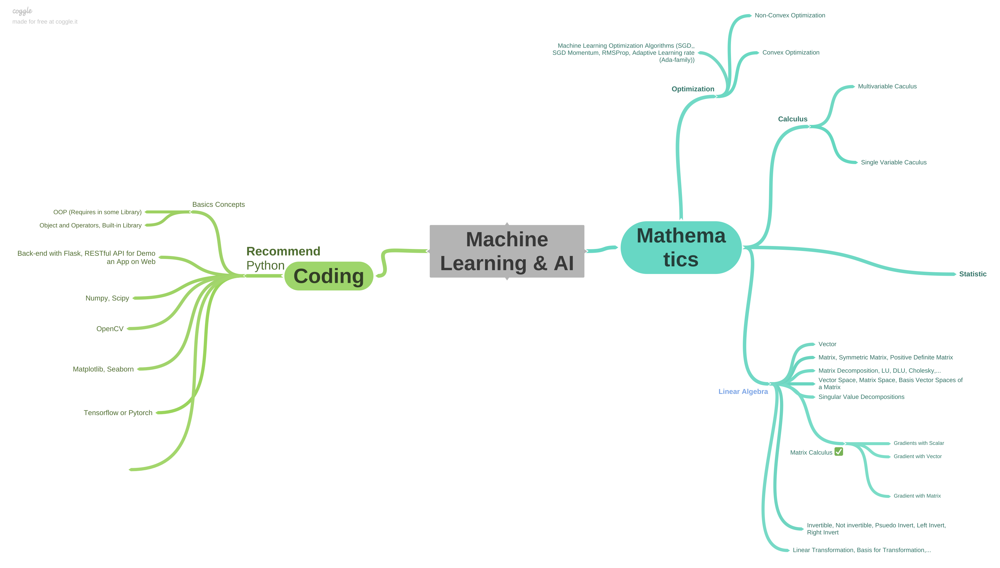

# Mathematics - Coding Material By phantah1@dungxibo123

# Briefly Career Map

>  ***Hello, we are 2 idiots***\
>  ***We just want to share our materials we luckily have a chance to meet on our way***

# Materials

# Mathematics
| Link | Content |
| ------ | ------ |
| **[Mathematics for Machine Learning][mml-book]** | Essential mathematic for machine learning |
| **[3blue1brown][3b1b]** | Basics Mathematics including LinAlg, Calculus, Prob&Stat |
| **[Steve Brunton][sb-math]** | Explain Mathematics behind ML Algorithms |
| **[Harvard Statistics][hv-stat]** | Havard's Statistic Book |
| **[Linear Algebra][lin-alg]** | Introduction to Linear Algebra - Prof. Strang |
| **[Convex Optimization][cvx-book]** | Convex Optimization by Stanford University, (EE364a, EE364b) |
| `Updating...` | `...` |

# Machine Learning @ Deep Learning

| Link | Content |
| ------ | ------ |
| **[Luis Serrano][luisSerrano]** | ML/DL with Cartoon Description |
| **[Zero to GAN][zero2gan]** | From Basics with tensor data to Generative adversarial network |
| **[Dive into Deep Learning][d2l-book]** | Deep Learning from Scratch |
| **[DATA DRIVEN SCIENCE & ENGINEERING][datauw-book]** | Data ~ ML ~ Dynamical Systems and Control  |
| **[Machine Learning Cơ bản][ml-basic]** | (VIE) Basic machine learning algorithm, best to start with one does not so well in English |
| **[Deep Learning cơ bản][dl-basic]** | (VIE) Basic in Deep Learning, Image Regconition, Image Segmentation, Generative Adversarial Networks (GAN), and so on,... |
| **[Pytorch Deep Learning][pytorch-dl]** | Deep learning in pytorch |
| **[UC Berkeley CS194-080 Full Stack Deep Learning][cs194-080]** | UC Berkeley Courses, full stack DL |
| **[DeepLearning AI on Coursera][deeplearning.ai]** | Many Free-Access Courses on Coursera, Nice to begin without any acknowledgement |
| `Updating...` | `...` |

# Other Useful Resources 
| Link | Content |
| ------ | ------ |
| **[2minpaper][2minpaper]** | Explain briefly SOME papers |
| **[MIT - Open Courses][mit-open]** | MIT Open Coures, many courses, LinAlg, Calculus,... |
| **[Papers with code][paper-code]** | Contain code for many papers |
| **[Paper Roadmap][paper-roadmap]** | Deep Learning Papers Reading Roadmap |

| `Updating...` | `...` |

> `Above is our link to specific content, we have not used them so much until now, so my briefly word cannot describe exactly what those sites bring to you.`

> `Maybe we dont have to much materials, feel free to contribute to this file by making new PR, please`
### End

Those materials still updating,...

##### Authors
* [phantah1][phantah1]
* [dungxibo123][dungxibo123]  

[//]: # (These are reference links used in the body of this note and get stripped out when the markdown processor does its job. There is no need to format nicely because it shouldn't be seen. Thanks SO - http://stackoverflow.com/questions/4823468/store-comments-in-markdown-syntax)
   [dl-basic]: <https://nttuan8.com/>
   [datauw-book]: <http://databookuw.com>
   [ml-basic]: <https://machinelearningcoban.com/>
   [hv-stat]: <http://probabilitybook.net/>
   [d2l-book]: <https://d2l.ai/>
   [phantah1]: <https://github.com/phantah1>
   [dungxibo123]: <https://github.com/dungxibo123>
   [mml-book]: <https://mml-book.github.io/book/mml-book.pdf>
   [phil-ml]: <https://www.youtube.com/channel/UC58v9cLitc8VaCjrcKyAbrw>
   [zero2gan]: <https://jovian.ai/learn/deep-learning-with-pytorch-zero-to-gans>
   [3b1b]: <https://www.youtube.com/channel/UCYO_jab_esuFRV4b17AJtAw>
   [2minpaper]: <https://www.youtube.com/user/keeroyz>
   [sb-math]: <https://www.youtube.com/channel/UCm5mt-A4w61lknZ9lCsZtBw>
   [cs194-080]: <https://docs.google.com/document/d/e/2PACX-1vSSSHcahlrJRvVq4qRKDX2jYLjhgpbWZjqmDcWZ7w3FWItZrlSKw6GY7rcSj5ZkJr6M0DaR8QbKCd8S/pub>
   [pytorch-dl]: <https://atcold.github.io/pytorch-Deep-Learning/>
   [mit-open]: <https://www.youtube.com/channel/UCEBb1b_L6zDS3xTUrIALZOw>
   [deeplearning.ai]: <https://www.coursera.org/search?query=Andrew%20Ng%20Machine%20LEarning&>
   [lin-alg]: <https://math.mit.edu/~gs/linearalgebra/>
   [cvx-book]: <https://web.stanford.edu/~boyd/cvxbook/>
   [paper-code]: <https://paperswithcode.com/>
   [paper-roadmap]: <https://github.com/floodsung/Deep-Learning-Papers-Reading-Roadmap>
   [luisSerrano]: <https://www.youtube.com/channel/UCgBncpylJ1kiVaPyP-PZauQ>
